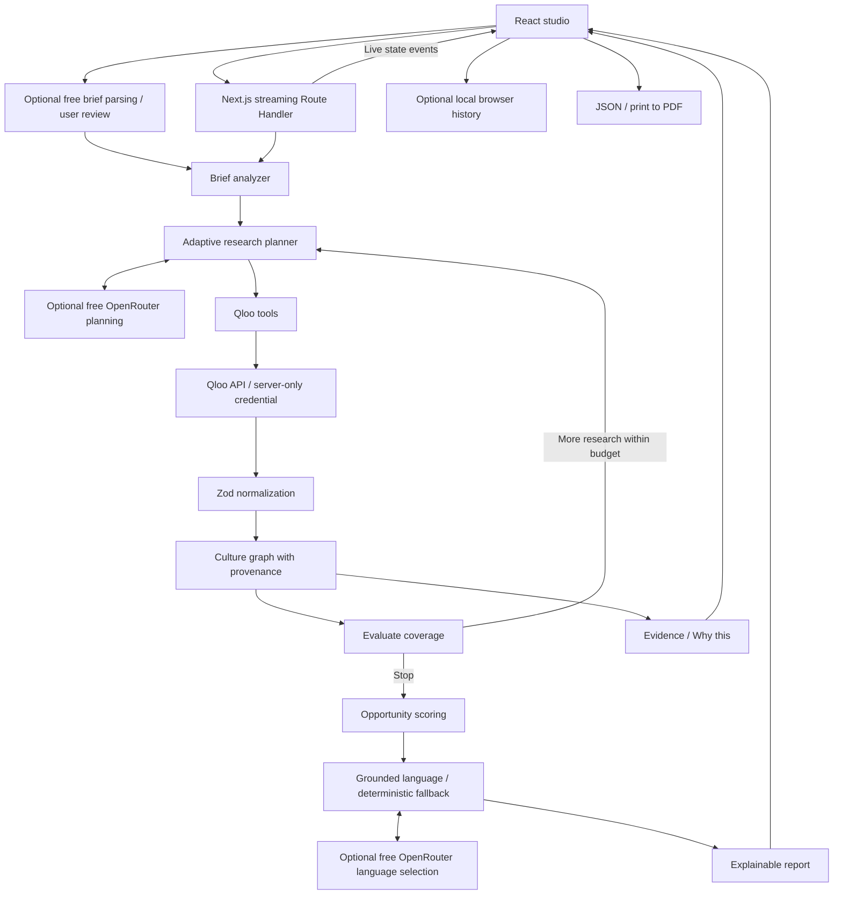

# CulturePilot

**Cultural intelligence for better market decisions.**

CulturePilot turns a business idea and audience into a traceable cultural strategy using Qloo's Taste Graph. It investigates, evaluates coverage, follows new connections, ranks opportunities and explains every recommendation—without a paid model API or a database.

**Live app:** deployment verification pending. **Source:** publication verification pending. Live research requires an event-issued Qloo key configured by the deployment owner. Production never substitutes a fictional report.

## What is CulturePilot?

A cultural research studio for founders, creators, marketers and product teams. Describe what you are building, who it is for, where it will launch and what you want to accomplish. A bounded agent investigates supported Qloo categories and returns an interactive evidence report with cultural signals, opportunities and concrete experiments.

## Problem

Generating a marketing idea is easy. Determining whether it fits an audience is harder. An audience's cultural world crosses brands, places, music and stories; a generic plan can miss those relationships and cannot explain what evidence shaped its suggestions.

## Solution

CulturePilot connects an idea to resolved cultural interests, explores real cross-category affinities, and proposes strategy hypotheses grounded in those relationships. “Why this?” follows every opportunity back to the originating API requests and affinity scores. Research ends within explicit budgets, and insufficient evidence produces an honest error.

## Why Qloo

Qloo supplies the entity identities and cultural relationships that materially determine the graph and recommendations. `GET /v2/tags` resolves category interests, `GET /search` resolves optional named seeds, and `GET /v2/insights` retrieves scored affinities across supported categories. Without successful Qloo research there is no strategy report.

The selected MVP dimensions are brands, places/dining, artists/music, books, and films. The typed adapter also supports podcasts and television. These are actual Qloo entity types, not invented “lifestyle” endpoints. Place research is market-constrained; other results supply broader cultural context. Age inputs map to supported bins, with any broadening disclosed.

## Agentic research loop

1. Analyze the brief and select five supported research dimensions.
2. Resolve optional named seeds, or discover an unambiguous Qloo category tag.
3. Research untouched categories from the resolved anchor.
4. Evaluate coverage and select strong discovered entities for cross-category follow-ups.
5. Stop after sufficient coverage, result density and two follow-ups, or at the step/call budget.
6. Score evidence-backed opportunities and select grounded strategy language, with deterministic fallback.

The planner reacts to actual results. Research progress is streamed as NDJSON state events; there are no fake timers. Defaults are 12 total steps, 12 Qloo calls and an 8 second request timeout. Cancellation and upstream failures stop the workflow.

## Architecture



One repository, one Next.js deployment. No Supabase, Firebase, Prisma, accounts, vector database, or separate backend. See [implementation contracts](docs/architecture.md).

### Optional zero-cost language layer

**Qloo = cultural truth. OpenRouter = intent and planning assistance. Deterministic code = graph, scores and evidence provenance.** The provider-independent `LLMProvider` interface supports brief parsing, research plans, validated action selection, strategy language and concise explanations. `OpenRouterProvider` is server-only; `DeterministicFallbackProvider` keeps the complete Qloo workflow usable when no language key or free capacity is available.

The current default is **`google/gemma-4-31b-it:free`**, verified against OpenRouter's [live model catalog](https://openrouter.ai/api/v1/models) and [provider endpoints](https://openrouter.ai/api/v1/models/google/gemma-4-31b-it:free/endpoints) on October 3, 2026: input and output pricing are **$0**, with a 262,144-token context and `response_format` support. Strict structured response requests are validated with Zod locally; endpoint formatting is never trusted. `openrouter/free` is the only alternate. We prefer Gemma for instruction following and the requested family; this is a suitability choice, not a claim of benchmark superiority over every free model.

Every inference checks a closed allowlist, verifies current zero pricing from a short-lived catalog cache, and requests `provider.max_price` of zero for prompt, completion, request and image. Paid, unknown, renamed or repriced models fail closed. No browser input selects a model. No paid plugins or external tools are enabled. Free quota can be limited; no purchase is required or attempted. A request has at most four inference calls, including retries, and at most one retry per operation. The default retry count is zero.

Natural-language briefs are converted into validated candidate form fields for **user review**, never automatically executed. The planner proposes five supported dimensions and can choose only deterministic candidate actions with resolved anchors. It cannot create a Qloo query outside the controller. For strict factual grounding, strategy narration selects among authored evidence-backed phrasing variants rather than accepting unrestricted generated prose. Deterministic code assigns all citations. This intentionally sacrifices free-form wording to prevent fabricated cultural claims. Why this retains actual Qloo entities, request-specific scores and source inputs. [Language contracts and cost controls](docs/openrouter.md).

## Culture Graph

React Flow shows brief, seed, category cluster, entity and opportunity nodes. Solid edges represent observed Qloo affinities from one resolved interest and its query context. Dashed edges represent derived group membership or strategy support. Every edge retains its research step and provenance.

Pan, zoom, fit view, filter by category, switch compact/explore modes, hover to focus related nodes and click nodes or edges to inspect their source. The visualization intentionally shows a subset; JSON exports preserve the full graph.

## Opportunity scoring

`Fit = round(100 × (0.50 × affinity + 0.20 × evidence density + 0.20 × category breadth + 0.10 × verified geography))`

Affinity is the mean of the opportunity's request-specific supporting edge scores. Density is capped at six relationships; category breadth at five categories. Geography receives points only for market-constrained place evidence. Cultural fit is the mean opportunity score. Evidence confidence measures coverage and density.

These are transparent product heuristics, not probabilities or Qloo-certified statistical estimates. [Full formulas, rationale and limitations](docs/scoring.md).

## Explainability

The evidence drawer presents supporting source → result relationships, affinity strengths, categories, score components, exact tool inputs and the planner's reason for the request. Research Trace includes resolution, API calls and synthesis, including the stopping condition. The strategy cites its source nodes and describes testable actions rather than guaranteed outcomes.

## Screenshots

Submission images are captured with Playwright at 1440×1000 using `npm run screenshots`. The script captures the landing page and brief, then captures live research and results **only when Qloo is configured and actually succeeds**. It never loads synthetic fixtures. Read [screenshot status](docs/screenshots/STATUS.md) for the available files and remaining live captures.

## Demo

Choose **Explore live demo** on the landing page. The sample brief is a premium specialty coffee brand in Madrid for urban professionals aged 25–35, with the objective “Launch a product.” Continue through four brief steps, then start live research.

Watch the timeline, inspect Audience DNA, filter the Culture Graph, open an opportunity's **Why this?**, read Strategy and expand Research Trace. Export JSON or choose **Print / PDF**. A complete print stylesheet includes strategy, evidence and research inputs regardless of the current tab.

No sample report is hardcoded. If the event key is missing, invalid, rate-limited or unavailable, the app explains the problem and preserves the brief for retry.

## Local setup

Requires Node.js 24 (or a compatible Node 22.19+ runtime), npm and an individually issued Qloo hackathon key.

```bash
npm ci
cp .env.example .env.local
# Set QLOO_API_KEY in .env.local, never in source code or browser state.
npm run dev
```

On PowerShell, use `Copy-Item .env.example .env.local` instead of `cp`. If `.env.local` already exists, add the Qloo variables to it without replacing existing settings.

Open `http://localhost:3000`. Missing credentials do not prevent building the frontend or running tests.

```bash
npm run lint
npm run typecheck
npm test
npm run build
npx playwright install chromium
npm run test:e2e
```

Unit tests use synthetic fixtures isolated under `tests/`. Browser tests intercept research only inside Playwright to verify the full report UI. A separate test checks the real missing-key production path. Synthetic test passing does not establish successful live Qloo integration.

## Environment variables

| Variable             | Default                          | Purpose                                                  |
| -------------------- | -------------------------------- | -------------------------------------------------------- |
| `QLOO_API_KEY`       | none                             | Server-only, event-issued key                            |
| `QLOO_BASE_URL`      | `https://hackathon.api.qloo.com` | Event host; no credential or host fallback               |
| `MAX_AGENT_STEPS`    | `12`                             | Total step budget, clamped to 3–16                       |
| `MAX_QLOO_CALLS`     | `12`                             | Per-analysis API budget, clamped to 2–14                 |
| `QLOO_TIMEOUT_MS`    | `8000`                           | Per-call timeout, clamped to 1000–10000                  |
| `OPENROUTER_API_KEY` | none                             | Optional server-only language key; empty = deterministic |
| `LLM_MODEL`          | `google/gemma-4-31b-it:free`     | Must belong to the production free allowlist             |
| `LLM_FALLBACK_MODEL` | `openrouter/free`                | Only allowlisted zero-cost fallback                      |
| `LLM_TIMEOUT_MS`     | `4000`                           | Inference deadline, clamped to 500–5000 ms               |
| `LLM_MAX_RETRIES`    | `0`                              | Additional attempts, clamped to 0–1; four-call total cap |
| `APP_URL`            | none                             | Optional HTTPS production origin for attribution         |

Never prefix a credential with `NEXT_PUBLIC_`. Do not paste keys in issues, screenshots, submission text or chat recordings. [Request event access](https://qloo.devpost.com/resources).

## Deployment

Deploy this repository as one Next.js project on Vercel. Node 24, build `npm run build`, framework preset Next.js. The route duration is configured to 180 seconds. Add `QLOO_API_KEY` to the **Production** environment, using the event host above, then redeploy. The app remains functional as a studio with an honest connection-needed state until the key is configured.

```bash
vercel link --yes --project culturepilot
vercel env add QLOO_API_KEY production
vercel --prod --yes
```

Enter the key at the interactive prompt or in Vercel's secret environment UI; do not put it in command arguments. Ensure deployment protection is disabled for the public judging app. Keep valid access through the end of judging.

Capture production screenshots after live verification:

```powershell
$env:SCREENSHOT_BASE_URL='https://YOUR-VERIFIED-PRODUCTION-HOST'
npm run screenshots
```

## Tech stack

Next.js 16.3.8 App Router, React 19.3, TypeScript, Tailwind CSS, customized shadcn-style primitives, Radix Dialog/Slot, Motion for React, React Flow, Recharts, Lucide, Zod, React Hook Form, Qloo API, Vercel, Vitest, Playwright and axe-core.

## Limitations

- Live Qloo behavior remains unverified until an event key is configured and the demo succeeds. Official rate limits, quota and expiration must be confirmed with organizers; no numerical entitlement is invented.
- Aggregate affinity is not individual preference, causal evidence, purchase intent, market size or willingness to pay.
- Occupation and freeform audience context are not automatically validated Qloo demographic segments. The research follows resolved interests and explicit supported age bins.
- Multiple seeds are resolved, but initial category discovery uses the first. Extra seeds are disclosed as context; they are not silently combined into one audience.
- Tag resolution rejects ambiguous lexical matches. A narrow or unsupported concept may need a specific named seed.
- Category evidence may be correlated. The confidence index is not statistical confidence.
- History and analysis URLs are local to the browser. Storage clearing removes reports; export to keep a durable copy.
- In-memory abuse controls are best-effort per instance, not a global distributed quota.
- Original code is MIT; Qloo data usage remains subject to its terms. Runtime dependencies currently audit clean; the lint toolchain has an upstream `braces` advisory without a published non-breaking fix at verification.

## Future work

Explicit candidate selection for ambiguous seeds, better cross-seed research, stronger commercial experiment tracking and user feedback on opportunity usefulness. Expand the grounded narrative vocabulary while preserving closed evidence contracts and zero-cost operation.

## Hackathon

New solo project started **October 3, 2026** specifically for the Qloo Agentic Hackathon. [Rule analysis](docs/hackathon-analysis.md), [Devpost draft](docs/devpost-submission.md), [optional demo script](docs/demo-video-script.md). Deadline: **October 31, 2026 at 04:45 Europe/Madrid**. A public usable demo and public licensed source are mandatory; a video is optional.

## License

[MIT](LICENSE) for original source. Third-party software remains under its respective license, and Qloo results remain subject to Qloo's API terms.
