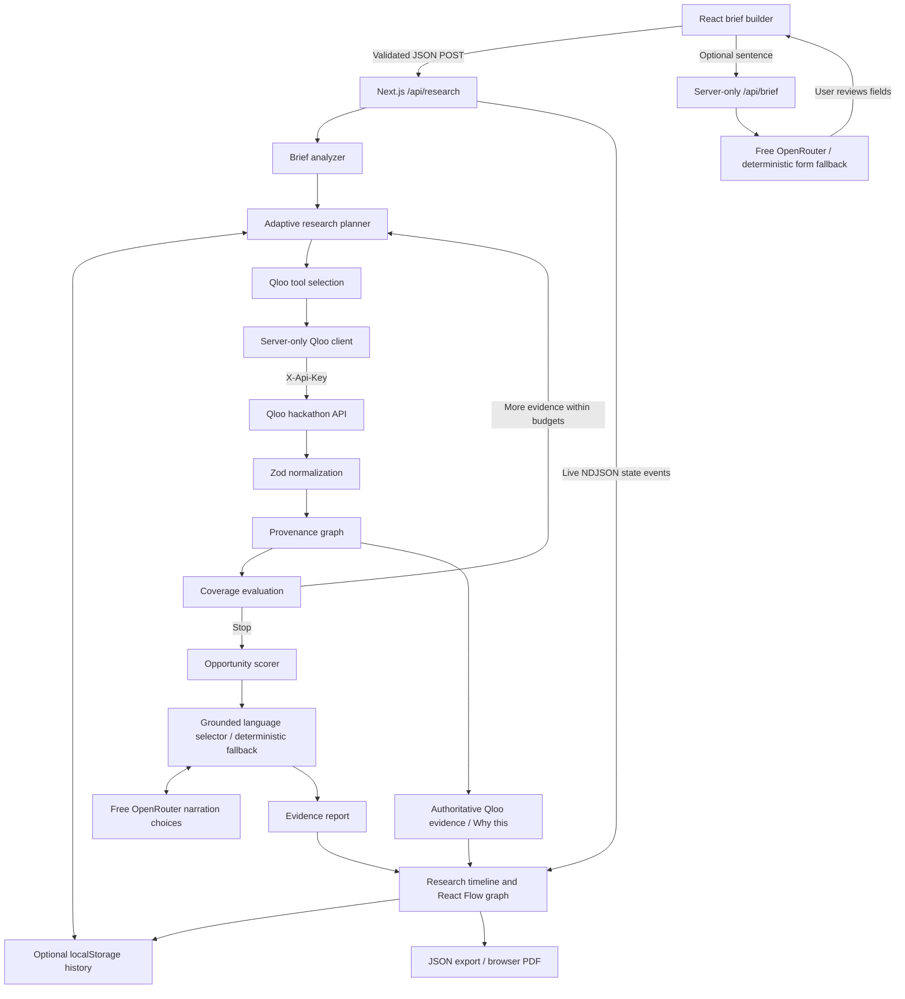

# CulturePilot architecture

One Next.js application, one deployment, no database. Qloo evidence is required; free OpenRouter language assistance is optional.

## Runtime contracts

- `briefSchema` validates user inputs, length, objective enum, bounded optional seeds and unexpected fields.
- The browser creates a session ID, storing the brief in sessionStorage and an in-memory provider. Reports are local to the browser. The URL is not a share link or a server lookup.
- `POST /api/research` enforces JSON, 8 KB streamed input size, same-origin browser requests, coarse per-isolate admission, and cancellation.
- The response is newline-delimited JSON. State snapshots emit when a step starts and completes. There are no fabricated progress timers. UI values come from actual state.
- `QlooClient` allows only known Qloo HTTPS hosts, refuses redirects, sends `X-Api-Key`, has a timeout, response-size limit and its own call budget. Missing keys make zero outbound requests. Raw Qloo errors are not surfaced.
- The planner uses a single resolved source interest per query. Graph edges record the source interest, returned entity, query-specific affinity, research step, and geographic constraint. Query demographic context is available through the step inputs.
- Initial research explores five supported categories. Follow-up research picks a strong discovered entity from a different category, targets a category with lower result density, and avoids repeating the same source/target query. Two cross-checks plus coverage and result-count thresholds are needed for the successful early stopping condition.
- Steps include input analysis, resolution, API exploration and final synthesis. Defaults: 12 total steps, 12 API calls, 8 second timeout. Hard deployment caps: 16 steps, 14 API calls, 10 seconds per call. Maximum route duration: 180 seconds.
- Every major recommendation exposes deterministic score components, real evidence IDs, Qloo edge IDs and a reasoning chain. The code-assigned evidence ledger preserves each entity's incoming query-specific relationships. The provider-independent `LLMProvider` interface is the language boundary; `SafeLanguageAssistant` validates suggestions and passes snapshots rather than mutable engine state. See [language contracts](openrouter.md).
- Optional sentence parsing calls `/api/brief`, validates a structured candidate, and requires form review. Planning proposes supported dimensions and selects only actual controller-generated action candidates. The controller still owns every Qloo request and budget. A validated language STOP requires at least 40% coverage and three entities; normal deterministic stopping remains coverage, density, follow-ups or budgets.
- Strategy narration selects authored variants grounded in existing evidence; it cannot add prose claims, citations, scores, entities or edges. Opportunity explanation choices are batched with strategy, and drawers make no inference calls. No key, timeout, invalid schema, rate limit or repricing switches to deterministic fallback.
- A fixed four-inference-attempt budget, 5-second maximum timeout and at most one retry prevent extra loops. A closed model allowlist, live catalog price check and zero-price provider cap prohibit paid model requests. Missing keys do not cause inference. The public integration status distinguishes configuration from proven connectivity.
- Trace fields include step number, actor, action, tool, safe input/output summaries, accepted results, evidence additions and duration. Graph construction is deterministically performed inside Qloo result steps; final synthesis is attributed to the scoring engine. Runtime tracks language calls, actual model, safe fallback status and strategy duration alongside existing Qloo/graph metrics.
- Heavy React Flow and Recharts components load dynamically. Radix manages evidence dialog focus/escape behavior. Motion respects reduced motion; CSS has a matching media query.

## Persistence and security scope

The history stores at most eight validated completed reports in localStorage. No server stores briefs or results. JSON export is a snapshot, not a publicly hosted share link. A reloaded live session can rerun research if no complete local report exists, consuming more Qloo quota.

Admission uses a bounded in-process map (five attempts per 10 minutes per observed IP, eight active runs per instance). It is best-effort protection, not a distributed quota or identity system. Vercel's separate instances do not share it. Use platform firewall controls if abuse appears; no database is added for the MVP.

The runtime provider modules that read credentials are marked `server-only`. Qloo client logic can be dependency-injected for tests, but no client component imports its credential-bearing construction. No secret is included in streamed state, localStorage, exported JSON, frontend environment or logs.

## Source map

| Area              | Files                                                                                                                  |
| ----------------- | ---------------------------------------------------------------------------------------------------------------------- |
| API routes        | `src/app/api/research/route.ts`, `src/app/api/status/route.ts`                                                         |
| Optional language | `src/app/api/brief/route.ts`, `src/lib/llm/*`, `src/lib/server/language.ts`                                            |
| Qloo              | `src/lib/qloo/client.ts`, `normalizer.ts`, `errors.ts`                                                                 |
| Agent             | `src/lib/agent/engine.ts`, `planner.ts`, `graph.ts`, `scoring.ts`, `narrator.ts`                                       |
| UI                | `src/components/brief-builder.tsx`, `analysis-workspace.tsx`, `report.tsx`, `culture-graph.tsx`, `evidence-drawer.tsx` |
| Browser history   | `src/lib/storage.ts`, `src/components/research-provider.tsx`                                                           |
| Verification      | `tests/agent.test.ts`, `tests/qloo.test.ts`, `tests/llm.test.ts`, `tests/e2e/*`                                        |
